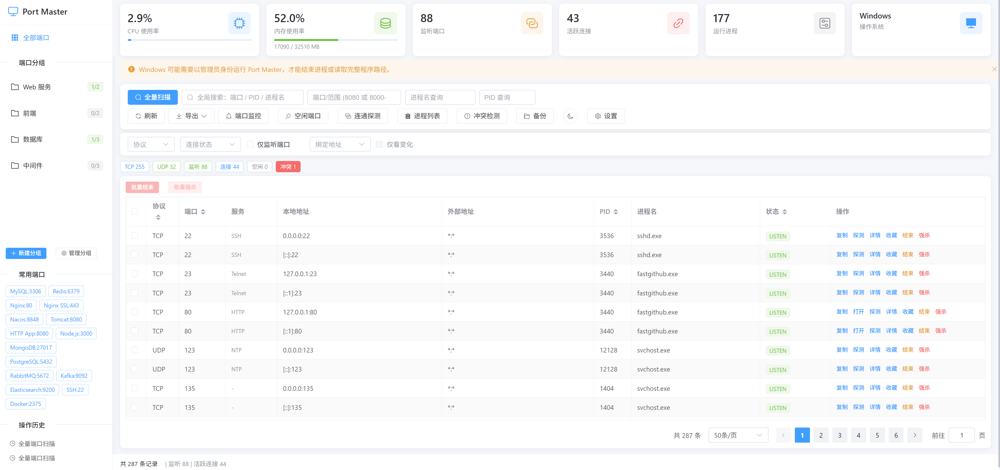

# Port Master - Port & Process Management

**English** | [简体中文](README.md)

Port Master is a cross-platform local port and process management tool. **v2.1.0** uses a Go backend and Vue 3 frontend. Production builds ship as one Go executable with embedded Vue assets.

This project references [MMCISAGOODMAN/port-master](https://github.com/MMCISAGOODMAN/port-master) and reimplements it with Go + Vue.

## Screenshot



## Features (v2.1.0)

### Ports & Probes

- Full TCP/UDP scan with `refresh=true` and configurable scan cache TTL.
- Query by port, expression, range, process name, PID; conflicts, free ports, scan diff.
- TCP, HTTP health, and TLS certificate probes (including expiry).
- Port monitoring: browser-local config + server polling with WebSocket alerts.

### Remote & Infrastructure

- **SSH remote hosts**: test / info / scan / kill; password or private key; favorites in browser only (no credentials stored).
- **Docker**: availability, container list & port mappings, stop / restart.
- **Kubernetes**: kubectl availability, context, Pods / Services / summary, optional namespace.
- **Network interfaces**: local NIC IP / MAC / status.

### UI & Data

- Scan history snapshots/trends, remote host favorites, groups / export / theme.
- **zh-CN / en** i18n including the auth dialog; switch language in Settings.
- **Token auth** enabled by default; WebSocket uses `?token=` aligned with REST.

## Stack

| Layer | Technology |
| --- | --- |
| Backend | Go 1.22, chi, gopsutil, golang.org/x/crypto/ssh, gorilla/websocket, embed |
| Frontend | Vue 3, Vite, Element Plus, vue-i18n, Axios |
| Storage | No database; settings in browser LocalStorage |
| Distribution | Single Go binary embedding `backend/internal/web/dist` |
| Platforms | Windows, Linux, macOS |

## Quick Start

### Development

```bash
cd backend
go run ./cmd/port-master --token dev-token
```

```bash
cd frontend
npm ci
npm run dev
```

Dev UI: `http://localhost:5173` (API proxied to `http://localhost:8080`). Log in with the backend token.

### Single-Binary Build

```bash
cd frontend
npm ci
npm run build

cd ../backend
go build -o port-master ./cmd/port-master
./port-master
```

## Authentication

| Option | Description |
| --- | --- |
| `--token your-token` | Fixed token |
| `PORT_MASTER_TOKEN` | Token via environment |
| No token | One-time token printed at startup |
| `--no-auth` | Disable auth |

REST (except `/api/auth/*`):

```http
Authorization: Bearer your-token
```

WebSocket monitor when auth is enabled:

```
ws://host/ws/monitor?token=your-token
```

## Server Config

Configure via **CLI flags** or **environment variables** (validated at startup; `scan-cache-ttl-ms=0` disables cache; monitor poll and SSH timeouts must be positive with upper bounds):

| CLI flag | Environment variable | Default | Description |
| --- | --- | --- | --- |
| `--scan-cache-ttl-ms` | `PORT_MASTER_SCAN_CACHE_TTL_MS` | 3000 | Scan cache TTL in ms; 0 disables cache |
| `--monitor-poll-ms` | `PORT_MASTER_MONITOR_POLL_MS` | 5000 | Background monitor poll interval (ms), min 1000 |
| `--ssh-connect-timeout-ms` | `PORT_MASTER_SSH_CONNECT_TIMEOUT_MS` | 10000 | SSH TCP connect/handshake timeout (ms) |
| `--ssh-command-timeout-sec` | `PORT_MASTER_SSH_COMMAND_TIMEOUT_SEC` | 60 | SSH remote command timeout (seconds) |

Example:

```bash
./port-master --token dev --scan-cache-ttl-ms 0 --monitor-poll-ms 10000 \
  --ssh-connect-timeout-ms 15000 --ssh-command-timeout-sec 60
```

`GET /api/system/config` returns the active values:

| Field | Description |
| --- | --- |
| `scanCacheTtlMs` | Scan cache TTL |
| `monitorPollIntervalMs` | Monitor poll interval |
| `sshConnectTimeoutMs` | SSH connect timeout |
| `sshCommandTimeoutSec` | SSH command timeout |
| `version` | App version |

Force refresh: `GET /api/ports/scan?refresh=true`

In dev mode, Vite proxies `/api` and `/ws` to the backend for same-origin WebSocket.

## SSH Host Key Policy

Remote SSH uses `golang.org/x/crypto/ssh` with **accept-unknown host keys** (`InsecureIgnoreHostKey`) for faster setup in trusted networks.

- Connect only to hosts you trust.
- Credentials are never logged, returned in errors, or stored in LocalStorage.
- Saved hosts store host/port/username/authType only—never passwords or keys.

## Main API (auth required except `/api/auth/*`)

| Module | Paths |
| --- | --- |
| Ports | `GET /api/ports/scan`, `/probe`, `/probe/http`, `/probe/tls`, `POST /api/ports/monitor` |
| Remote | `POST /api/remote/test`, `/info`, `/scan`, `/kill` |
| Docker | `GET /api/docker/available`, `/containers`, `POST /stop`, `/restart` |
| K8s | `GET /api/k8s/available`, `/context`, `/pods`, `/services`, `/summary` |
| Network | `GET /api/network/interfaces` |
| Monitor | `POST /api/monitor/config`, `GET /api/monitor/status` |
| System | `GET /api/system/stats`, `/info`, `/config` |
| WebSocket | `GET /ws/monitor` |

Response shape: `{ "code": 200, "message": "success", "data": ... }`

## Permissions

No automatic privilege elevation. Process kill and full paths depend on the current user.

- Windows: run as Administrator when needed.
- Linux/macOS: use root/sudo when required.

## License

MIT
